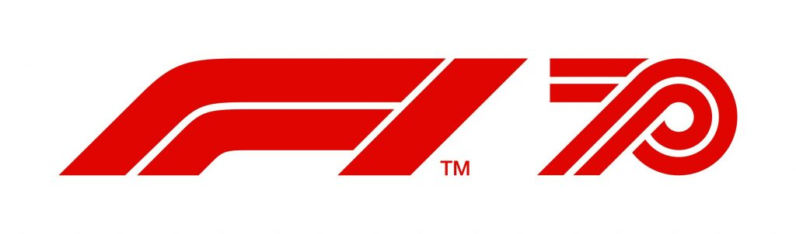

# 🏎 Formula 1 Analysis

<figure><figcaption></figcaption></figure>

## Resources

* ~~\*\*\*~~[~~**pyErgast**~~](https://github.com/weiranyu/pyErgast)~~**:** Python pandas wrapper for the~~ [~~Ergast F1 API~~](http://ergast.com/mrd/)~~. This package allows easy access to the Ergast API for anyone wishing to conduct analysis on Formula 1 data.~~&#x20;
  * _(After further exploration of other package options; FastF1 is a much better option for working with the data, it also provides us with much more information)._&#x20;
* [**FastF1**](https://theoehrly.github.io/Fast-F1/index.html): FastF1 gives you access to F1 lap timing, car telemetry and position, tyre data, weather data, the event schedule and session results. The module is designed around Pandas, Numpy and Matplotlib. This makes it easy to use while offering lots of possibilities for data analysis and visualization. FastF1 handles big chunks of data (\~50-100mb per session) so most of the information is stored locally as cached requests (be aware).
  *   All data is downloaded from two sources:

      > * The official f1 data stream -> [f1-live](https://www.formula1.com/en/f1-live.html)
      > * Ergast web api -> [ergast.com](http://ergast.com/mrd/)
  * Timing data, car telemetry and position data is available for the 2018 and later seasons. Schedule information and session results are available for older seasons too. (limited to [Ergast web api](http://ergast.com/mrd/)).
  * FastF1 is unofficial software and in no way associated with the Formula 1 group of companies.
* [**Ergast API**](http://ergast.com/mrd/)**:** The Ergast Developer API is an experimental [web service](http://en.wikipedia.org/wiki/Web\_service) which provides a historical record of motor racing data for non-commercial purposes. Please read the [terms and conditions of use](http://ergast.com/mrd/terms). The API provides data for the [Formula One](http://en.wikipedia.org/wiki/Formula\_One)series, from the beginning of the world championships in 1950.
  * Use of the Ergast API is completely free, but you are welcome to [contribute to the annual running costs](https://liberapay.com/ergast). Any contributions above the actual costs will be donated to the [Grand Prix Trust](https://www.grandprixtrust.com/).

### Licenses

#### FastF1

MIT License

Copyright (c) 2022 theOehrly

Permission is hereby granted, free of charge, to any person obtaining a copy of this software and associated documentation files (the "Software"), to deal in the Software without restriction, including without limitation the rights to use, copy, modify, merge, publish, distribute, sublicense, and/or sell copies of the Software, and to permit persons to whom the Software is furnished to do so, subject to the following conditions:

The above copyright notice and this permission notice shall be included in all copies or substantial portions of the Software.

THE SOFTWARE IS PROVIDED "AS IS", WITHOUT WARRANTY OF ANY KIND, EXPRESS OR IMPLIED, INCLUDING BUT NOT LIMITED TO THE WARRANTIES OF MERCHANTABILITY, FITNESS FOR A PARTICULAR PURPOSE AND NONINFRINGEMENT. IN NO EVENT SHALL THE AUTHORS OR COPYRIGHT HOLDERS BE LIABLE FOR ANY CLAIM, DAMAGES OR OTHER LIABILITY, WHETHER IN AN ACTION OF CONTRACT, TORT OR OTHERWISE, ARISING FROM, OUT OF OR IN CONNECTION WITH THE SOFTWARE OR THE USE OR OTHER DEALINGS IN THE SOFTWARE.
